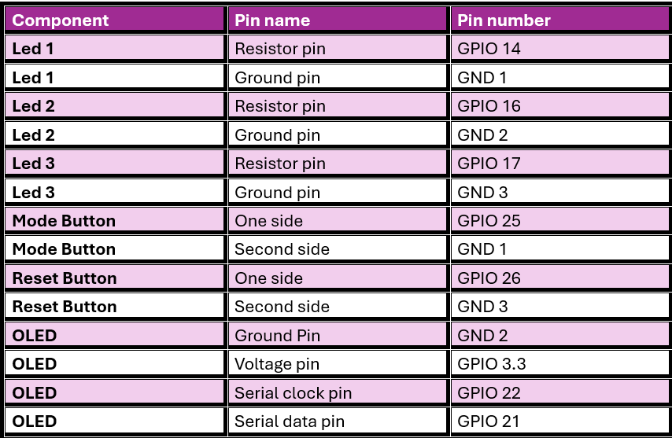

<h1>Pin Map For Circuit Diagram</h1>
</img>
 

<h1>Wokwi Output ScreenShots</h1>
</img>
 
</img>
 
</img>
 
</img>
 
</img>

 
 
<h1>Wokwi Project Link</h1>
<a href="https://wokwi.com/projects/445158302195113985">Visit Wokwi Project</a>
 
 

<h1>Hardware Output Pictures</h1>
</img>
 
</img>
 
</img>
 
</img>
 
</img>